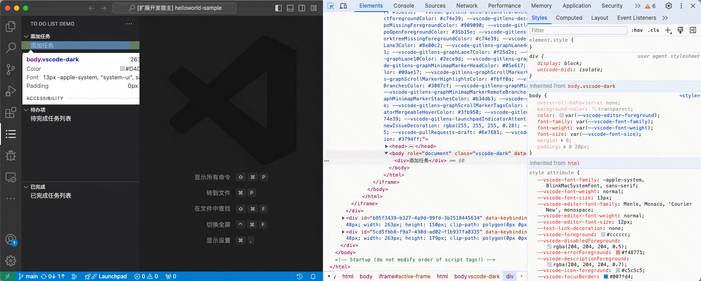
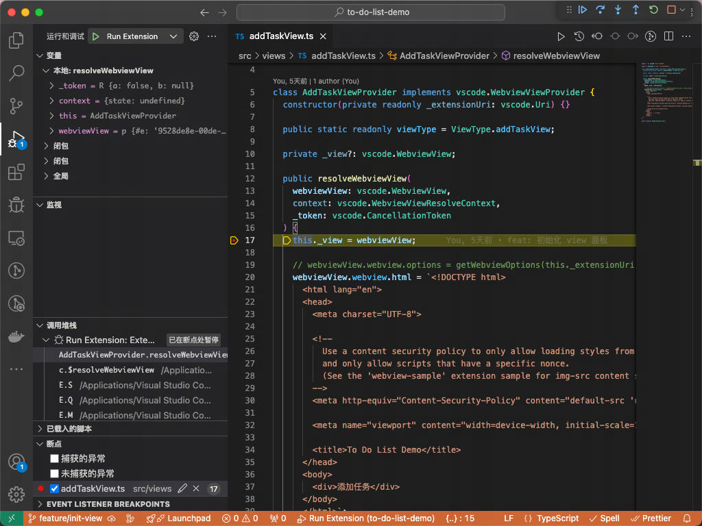

## 开发调试流程

1. 项目根目录执行 `pnpm install`

2. 项目根目录执行 `pnpm watch`

3. 完成功能开发后，在插件代码窗口中唤起命令行面板（⇧⌘P），并执行 `Debug: Start Debugging`，便会打开一个新的插件调试窗口，此时在活动栏中就可以找到我们的插件 icon，点击后即可看到插件的视图（见步骤 4 图示）。

4. 如果你要检查元素样式，可以在命令行面板中输入执行 `Developer: Toggle Developer Tools`，这时就会出现开发者工具窗口，之后便可以像调试浏览器中的网页一样调试这些 webview，如图示：

   

5. 如果你要调试插件代码，可使用 vscode 内置的 debug 功能，只需在相应的代码行处添加断点，这样当你打开插件调试窗口后，vscode 就会自动命中这些断点，如图示：

   

6. 当你修改了部分代码后，在插件调试窗口，你可以在命令行面板中输入 `Developer: Reload Webview` 以重新加载所有 webview（或通过 ⌘R 刷新也行）

## 发布流程

### 准备工作

1. 执行 `pnpm add -g @vscode/vsce` 全局安装 vsce 工具

### 本地测试

1. 执行 `pnpm vsce:package` 生成 `.vsix` 文件。

2. 打开扩展程序面板，点击右上角 `更多` 标识，选择从 `VSIX` 安装插件（或通过命令安装 `code --install-extension my-extension-0.1.0.vsix`）。

### 预发布

1. 更新 `package.json 中版本号`

2. 执行 `pnpm vsce:pre-release`

### 发布

1. 更新 `package.json 中版本号及 CHANGELOG.md`

2. 执行 `pnpm vsce:publish`
